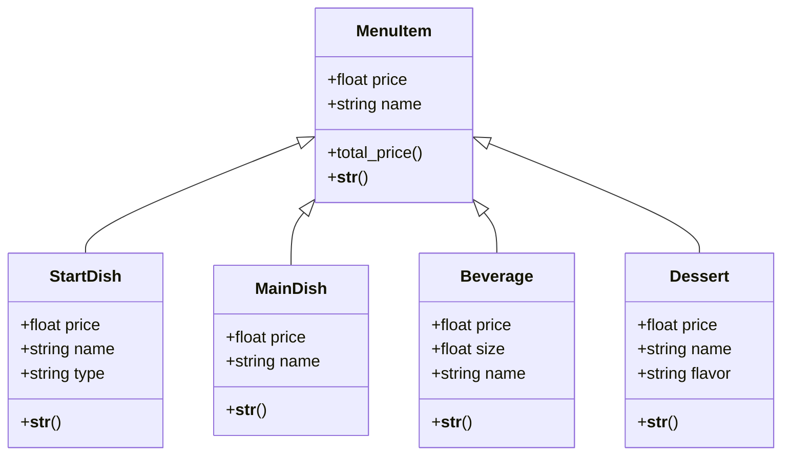

# Reto3_poo
En este repo se encuentra el desarrollo del reto 3.  A continuacion esta el diagrama de las clases que se encuentran en el codigo, todo esto acerca del menu de un restaurante.

```mermaid
classDiagram
direction TB


    class MenuItem {
        +float price 
        +string name

        +total_price()
        +__str__()
    }

    class StartDish {
        +float price
        +string name
        +string type
        
        +__str__()
	   
      
    }
    class MainDish{
        +float price
        +string name
        
        +__str__()


    }
    class Beverage{
	    +float price
        +float size 
        +string name
        
        +__str__()


	   
    }

    class Dessert {
       +float price
       +string name
       +string flavor
        

        +__str__()

        
        

    }

    class Order {
        +startdish boolean
        +maindish  boolean
        +beverage  boolean
        +dessert   boolean

        +total_order()
        +show_order()
}

````
En general son 6 clases , la mayoría tiene como método str() ya que solamente devuelven cadenas de texto para este caso.

### Composicion:
Existe una realcion de composicion ya que si se destruye la orden, esos platos elegidos dejan de existir dentro de ella.


```mermaid
classDiagram
direction TB


 

    class StartDish {
        +float price
        +string name
        +string type
        
        +__str__()
	   
      
    }
    class MainDish{
        +float price
        +string name
        
        +__str__()


    }
    class Beverage{
	    +float price
        +float size 
        +string name
        
        +__str__()


	   
    }

    class Dessert {
       +float price
       +string name
       +string flavor
        

        +__str__()

        
        

    }

    class Order {
        +startdish boolean
        +maindish  boolean
        +beverage  boolean
        +dessert   boolean

        +total_order()
        +show_order()

    }
    Order--*StartDish
    Order--*MainDish
    Order--*Beverage
    Order--*Dessert
   
```

### Herencia:
Existe una relacion de herencia entre MenuItem y las clases posteriores , en donde las clases heredan atributos de la clase padre que es MenuItem.



